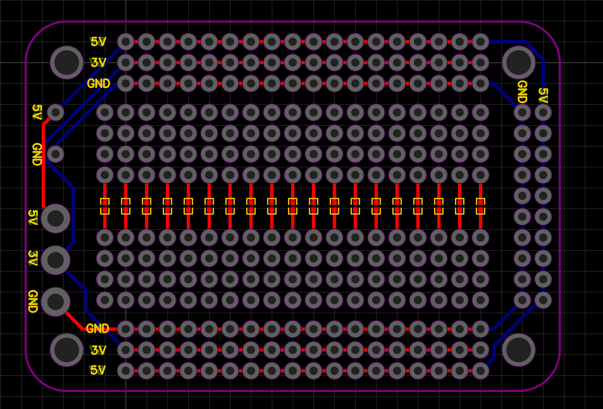
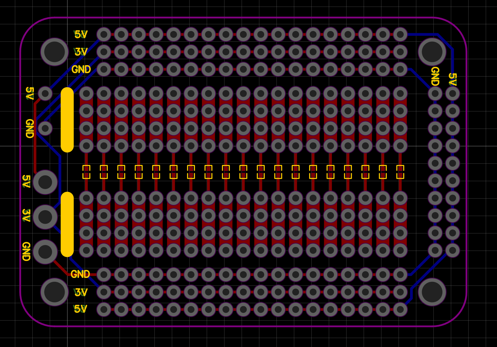
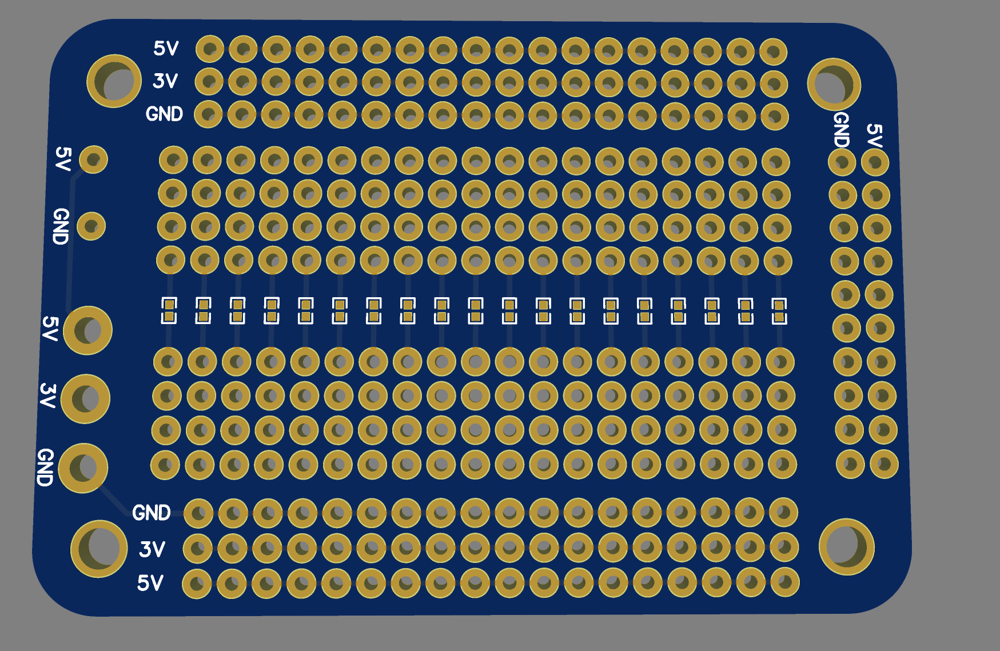
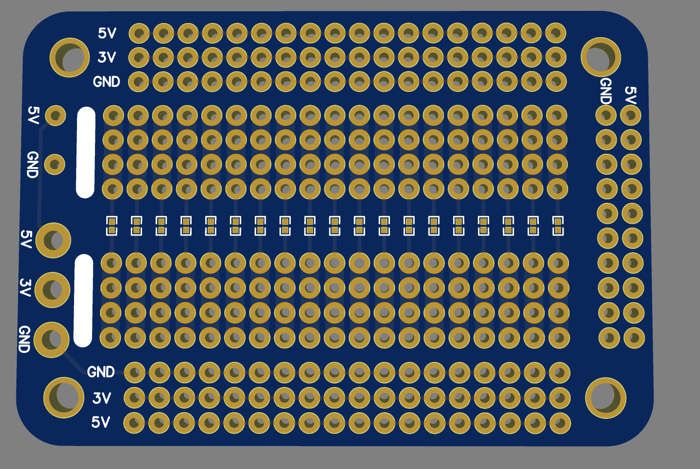

**65x45mm.**
___

* [O1:](https://github.com/Mathiaszmrga/ProtoPCBs/tree/main/65x45/O1)
  * [PCB.](https://github.com/Mathiaszmrga/ProtoPCBs/tree/main/65x45/O1/PCB)
Source and manufacturing files
  * [Photos.](https://github.com/Mathiaszmrga/ProtoPCBs/tree/main/65x45/O1/Photos)
* [O2:](https://github.com/Mathiaszmrga/ProtoPCBs/tree/main/65x45/O1)
  * [PCB.](https://github.com/Mathiaszmrga/ProtoPCBs/tree/main/65x45/O2/PCB)
Source and manufacturing files
  * [Photos.](https://github.com/Mathiaszmrga/ProtoPCBs/tree/main/65x45/O2/Photos)

___

|	Attributes	|	Description/notes	|
|:--|:--|
|	3mm holes|	3mm holes	|
|	Support for screw terminal	|	Standard spacing for screw [terminals](https://lcsc.com/product-detail/Screw-terminal_Ningbo-Kangnex-Elec-WJ126V-5-0-3P_C8401.html) or wire.|
|	Bridge pad|	Pad to bridge with solder and join both sets of pins together.|
|	Tripple voltage support|	Supports multiple supply voltages in a single PCB, for example (5 and 3 + GND).|

___

Board| Description/notes | Preview
|:--|:--|:--|
O1| 45x65mm proto-PCB with each set of holes independent | 
O2| 45x65mm proto-PCB with each set of holes joined together similar to a standard breadboard| 

___

| Board | 3D view |
|:--|:--|
| O1 |  |
| O2 |  |
